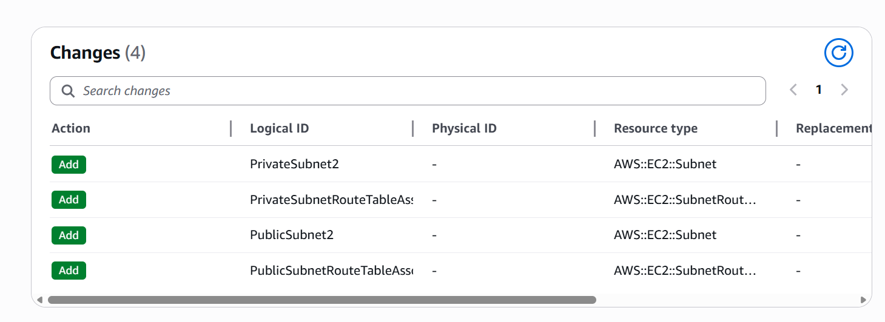
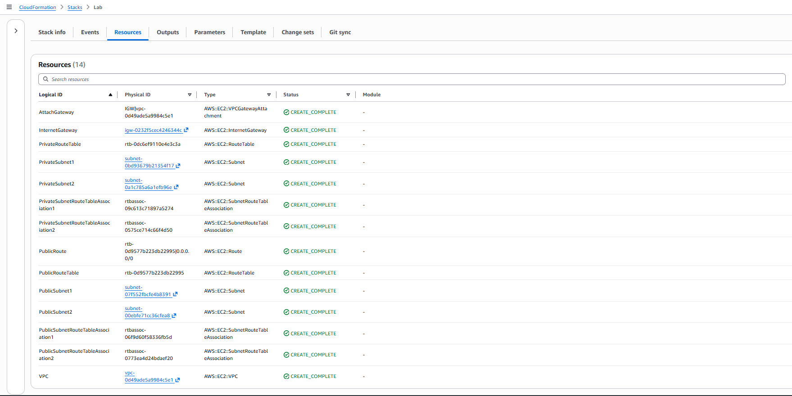
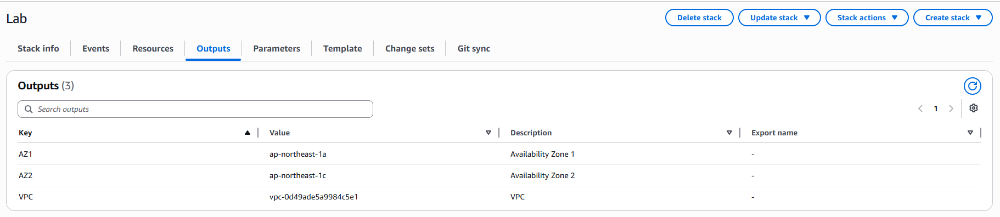
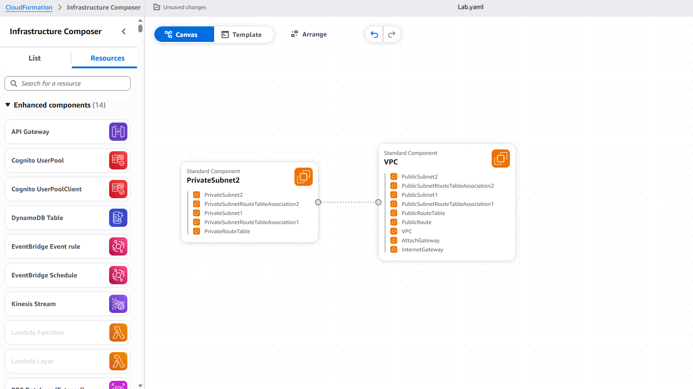
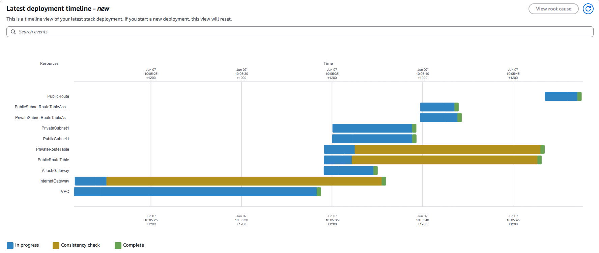

# AWS Infrastructure as Code

Infrastructure as Code (IaC) examples using AWS CloudFormation, showcasing cloud architecture, networking, and infrastructure automation.

## Overview

This repository demonstrates how AWS CloudFormation can be used to provision, manage, and evolve cloud infrastructure through Infrastructure as Code principles.

The project begins with a foundational VPC deployment consisting of a public and private subnet and then demonstrates infrastructure evolution through CloudFormation stack updates to create a highly available multi-Availability Zone architecture.

## Project Objectives

This project demonstrates the ability to:

* Deploy AWS infrastructure using CloudFormation templates
* Create and manage Amazon VPC networking components
* Update CloudFormation stacks using Infrastructure as Code
* Validate infrastructure changes through Change Sets
* Visualize infrastructure using AWS Infrastructure Composer
* Manage infrastructure through version-controlled templates

## Repository Structure

```text
aws-infrastructure-as-code/
├── cloudformation/
│   └── vpc/
│       ├── v1-single-az-vpc.yaml
│       └── v2-multi-az-vpc.yaml
├── docs/
│   ├── architecture.md
│   └── screenshots/
│       ├── cloudformation-change-set.png
│       ├── cloudformation-resources-v2.png
│       ├── cloudformation-outputs.png
│       ├── cloudformation-deployment-timeline.png
│       └── infrastructure-composer.png
└── README.md
```

## Architecture Evolution

### Version 1 - Single Availability Zone

Initial deployment included:

* Amazon VPC
* Internet Gateway
* Public Subnet
* Private Subnet
* Public Route Table
* Private Route Table

### Version 2 - Multi Availability Zone

The CloudFormation stack was updated to improve availability and scalability.

Enhancements included:

* Public Subnet 2
* Private Subnet 2
* Additional Route Table Associations
* Multi-AZ architecture

This demonstrates how Infrastructure as Code can be used to safely evolve cloud infrastructure through CloudFormation stack updates.

## Deployment Evidence

### CloudFormation Change Set

The following change set shows the planned infrastructure updates required to evolve the environment from two subnets to four subnets.



### CloudFormation Resources

Resources successfully provisioned after the stack update.



### CloudFormation Outputs

Generated outputs from the CloudFormation stack.



### AWS Infrastructure Composer

Visual representation of the deployed infrastructure.



### Deployment Timeline

CloudFormation deployment timeline showing resource creation and provisioning sequence.



## Skills Demonstrated

### Infrastructure as Code

* AWS CloudFormation
* Infrastructure Automation
* Declarative Infrastructure Deployment
* Template Management
* Change Set Validation

### AWS Networking

* Amazon VPC
* Public and Private Subnets
* Internet Gateway
* Route Tables
* Route Table Associations
* Multi-AZ Design

### Cloud Operations

* Stack Deployment
* Stack Updates
* Infrastructure Validation
* Resource Lifecycle Management

### Architecture & Design

* Cloud Network Design
* Infrastructure Documentation
* High Availability Design
* Infrastructure Composer

## Future Enhancements

Planned additions include:

* NAT Gateway
* Security Groups
* EC2 Deployments
* Application Load Balancers
* Auto Scaling Groups
* Amazon RDS
* CloudWatch Monitoring
* Terraform Examples
* CI/CD Integration

## Author

**Shehan Warnakulasuriya**

Senior Systems Analyst Specialist
AWS Certified Solutions Architect – Associate
Cloud & Platform Engineering
Aspiring Solutions Architect
